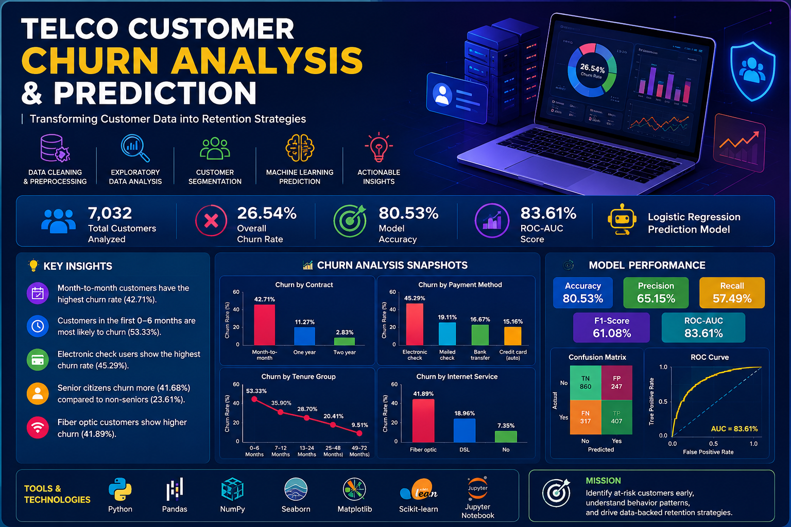

<p align="center">
  
</p>

# 📊 Telco Customer Churn Analysis & Prediction

<p align="center">

**Turning customer data into actionable churn insights and predictive intelligence.**

<br>

<a href="https://github.com/abhijitpavse/telco-customer-churn-analysis">

</a>


</p>

---

## 🚀 Overview

Customer churn is a critical business problem for subscription-based companies.

This project analyzes telecom customer data to understand **who is leaving, what patterns are associated with churn, which customer segments are most vulnerable, and how machine learning can help identify potential churners.**

The workflow combines:

**Data Cleaning → Exploratory Analysis → Customer Segmentation → Feature Engineering → Churn Prediction → Model Evaluation → Business Insights**

The goal is not only to build a predictive model, but to transform raw customer records into **clear, interpretable and actionable business insights**.

---

## 🎯 What This Project Answers

> **Who is most likely to churn — and why?**

The analysis investigates questions such as:

* 📉 What percentage of customers are churning?
* 📅 Does customer tenure influence churn?
* 📄 Which contract types have the highest churn?
* 💳 Does payment method relate to customer retention?
* 🌐 How does internet service relate to churn?
* 💰 Are higher monthly charges associated with greater churn?
* 👥 Which customer segments are most vulnerable?
* 🤖 How accurately can churn be predicted?
* 💡 What retention strategies can be derived from the data?

---

# 🔄 Analytical Workflow

```text
                 ┌─────────────────────┐
                 │   Raw Customer Data │
                 └──────────┬──────────┘
                            │
                            ▼
                 ┌─────────────────────┐
                 │ Data Cleaning       │
                 │ & Preprocessing      │
                 └──────────┬──────────┘
                            │
                            ▼
                 ┌─────────────────────┐
                 │ Exploratory         │
                 │ Data Analysis       │
                 └──────────┬──────────┘
                            │
                            ▼
                 ┌─────────────────────┐
                 │ Customer            │
                 │ Segmentation        │
                 └──────────┬──────────┘
                            │
                            ▼
                 ┌─────────────────────┐
                 │ Feature Engineering │
                 └──────────┬──────────┘
                            │
                            ▼
                 ┌─────────────────────┐
                 │ Churn Prediction    │
                 │ Logistic Regression │
                 └──────────┬──────────┘
                            │
                            ▼
                 ┌─────────────────────┐
                 │ Model Evaluation    │
                 └──────────┬──────────┘
                            │
                            ▼
                 ┌─────────────────────┐
                 │ Business Insights   │
                 │ & Recommendations   │
                 └─────────────────────┘
```

---

# 📁 Repository Structure

The structure below matches the repository you currently have, including the root-level notebook and the `outputs` folders.

```text
telco-customer-churn-analysis/
│
├── 📊 Customer_Churn_Analysis.ipynb
│
├── 📂 outputs/
│   │
│   ├── 📈 charts/
│   │   ├── churn_distribution.png
│   │   ├── churn_by_contract.png
│   │   ├── churn_by_payment_method.png
│   │   ├── churn_by_tenure.png
│   │   ├── churn_by_internet_service.png
│   │   ├── monthly_charges_boxplot.png
│   │   ├── tenure_boxplot.png
│   │   ├── confusion_matrix.png
│   │   └── roc_curve.png
│   │
│   └── 🧹 cleaned_data/
│       ├── telco_cleaned.csv
│       ├── telco_encoded.csv
│       ├── contract_churn_summary.csv
│       ├── payment_churn_summary.csv
│       ├── tenure_churn_summary.csv
│       ├── monthly_charge_segment_summary.csv
│       ├── customer_segment_analysis.csv
│       └── model_metrics.csv
│
├── 📄 Telco_Customer_Churn_Dataset .xls
│
└── 📖 README.md
```

> **Note:** The notebook is intentionally kept at the repository root in the current project structure.

---

# 🧹 Data Preparation

The raw dataset contains customer demographic, service, contract and billing information.

The preprocessing pipeline includes:

* Dataset structure inspection
* Data type validation
* Missing-value detection
* Invalid/blank value handling
* `TotalCharges` conversion to numeric
* Duplicate detection
* Churn label transformation
* Categorical variable encoding
* Analytical dataset preparation

### Churn Encoding

```text
No  → 0
Yes → 1
```

The dataset initially contains **7,043 customer records and 21 variables**.

After cleaning the invalid/blank `TotalCharges` records, the analytical dataset contains:

### **7,032 customers**

---

# 🔍 Exploratory Data Analysis

The EDA phase focuses on understanding the behavioral and demographic characteristics associated with customer churn.

### Analysis Areas

| Area               | Purpose                                 |
| ------------------ | --------------------------------------- |
| Churn Distribution | Understand overall customer attrition   |
| Tenure             | Identify high-risk lifecycle stages     |
| Contract           | Compare retention across contract types |
| Payment Method     | Identify payment-related churn patterns |
| Internet Service   | Compare service-level churn             |
| Senior Citizen     | Examine demographic differences         |
| Monthly Charges    | Understand billing-related patterns     |
| Customer Segments  | Identify high-risk groups               |

---

# 📊 Key Findings

## 1. Overall Churn

The dataset shows an overall churn rate of approximately:

### **26.54%**

This means roughly **1 in every 4 customers** in the analyzed dataset has churned.

---

## 2. Contract Type Is Strongly Associated With Churn

| Contract Type  | Churn Rate |
| -------------- | ---------: |
| Month-to-month | **42.71%** |
| One year       | **11.27%** |
| Two year       |  **2.83%** |

### 💡 Insight

Month-to-month customers show substantially higher churn than customers on longer-term contracts.

This makes contract structure an important variable for retention analysis.

---

## 3. Early-Tenure Customers Are High Risk

| Tenure Group | Churn Rate |
| ------------ | ---------: |
| 0–6 months   | **53.33%** |
| 7–12 months  |   **~36%** |
| 13–24 months |   **~29%** |
| 25–48 months |   **~20%** |
| 49–72 months |  **9.51%** |

### 💡 Insight

The earliest stage of the customer lifecycle shows the highest observed churn.

This suggests that onboarding and early engagement can be important areas for retention efforts.

---

## 4. Payment Method Shows a Strong Difference

| Payment Method   | Churn Rate |
| ---------------- | ---------: |
| Electronic check | **45.29%** |
| Mailed check     |   **~19%** |
| Bank transfer    |   **~17%** |
| Credit card      |   **~15%** |

### 💡 Insight

Electronic-check customers have the highest observed churn rate among payment methods.

This relationship should be investigated alongside contract type, tenure and customer characteristics before drawing causal conclusions.

---

## 5. Senior Customers Show Higher Observed Churn

| Customer Group  | Churn Rate |
| --------------- | ---------: |
| Senior citizens | **41.68%** |
| Non-senior      | **23.61%** |

This identifies senior customers as another segment worth investigating during retention analysis.

---

## 6. Fiber-Optic Customers Show Higher Churn

| Internet Service    | Churn Rate |
| ------------------- | ---------: |
| Fiber optic         | **41.89%** |
| DSL                 |   **~19%** |
| No internet service |    **~7%** |

> **Important:** This is an observed relationship in the dataset and should not be interpreted as proof that fiber-optic service causes churn.

Further analysis would be required to understand the underlying drivers.

---

# 👥 Customer Segmentation

Customer segments were created using:

### 📅 Tenure

```text
0–6 Months
7–12 Months
13–24 Months
25–48 Months
49–72 Months
```

### 💰 Monthly Charges

```text
Low
Medium
High
Very High
```

### 📄 Contract Type

```text
Month-to-month
One year
Two year
```

These dimensions can be combined to identify customer groups with significantly different churn behavior.

---

# 🤖 Churn Prediction

A **Logistic Regression** model is used to estimate whether a customer is likely to churn.

### Prediction Pipeline

```text
Customer Data
      ↓
Preprocessing
      ↓
Feature Encoding
      ↓
Train / Test Split
      ↓
Feature Scaling
      ↓
Logistic Regression
      ↓
Probability Prediction
      ↓
Churn Classification
```

---

# 📈 Model Performance

| Metric    |      Score |
| --------- | ---------: |
| Accuracy  | **80.53%** |
| Precision | **65.15%** |
| Recall    | **57.49%** |
| F1-Score  | **61.08%** |
| ROC-AUC   | **83.61%** |

### Why ROC-AUC matters

Because churn is not evenly distributed across the dataset, accuracy alone does not provide a complete picture of model performance.

ROC-AUC provides an additional view of the model's ability to distinguish between customers who churn and those who remain.

---

# 💡 Business Recommendations

The analysis can be translated into several practical retention strategies.

### 🎯 1. Prioritize New Customers

Customers in their first few months show substantially higher churn.

Possible actions:

* Improve onboarding
* Conduct early satisfaction checks
* Provide proactive support
* Offer personalized onboarding assistance

---

### 🔄 2. Encourage Long-Term Contracts

Month-to-month customers show significantly higher churn.

Possible approaches:

* Contract upgrade incentives
* Loyalty benefits
* Annual-plan discounts
* Personalized conversion campaigns

---

### 💳 3. Investigate Electronic-Check Customers

The high observed churn rate among electronic-check users warrants deeper investigation into:

* Billing experience
* Payment failures
* Payment convenience
* Contract distribution
* Customer demographics

---

### 🌐 4. Investigate Fiber-Optic Churn

Rather than assuming a direct cause, investigate:

* Pricing
* Technical support
* Service quality
* Contract type
* Customer tenure

---

### 🧠 5. Use Risk-Based Customer Targeting

A more effective retention strategy can combine:

```text
Customer Segment
        +
Churn Probability
        +
Customer Value
        ↓
Retention Priority
```

This allows businesses to focus resources on customers where intervention could have the greatest potential value.

---

# 🛠️ Technology Stack

### Programming

🐍 **Python**

### Data Analysis

🐼 **Pandas**
🔢 **NumPy**

### Data Visualization

📊 **Matplotlib**
📈 **Seaborn**

### Machine Learning

🤖 **Scikit-learn**

### Development Environment

📓 **Jupyter Notebook**

### Version Control

🔗 **Git & GitHub**

---

# ▶️ Run the Project

### Clone the repository

```bash
git clone https://github.com/abhijitpavse/telco-customer-churn-analysis.git
```

### Navigate to the project

```bash
cd telco-customer-churn-analysis
```

### Install required libraries

```bash
pip install pandas numpy matplotlib seaborn scikit-learn jupyter
```

### Launch Jupyter

```bash
jupyter notebook
```

### Open

```text
Customer_Churn_Analysis.ipynb
```

Then run the notebook from top to bottom.

---

# 🧪 Reproducibility

The notebook is designed to keep the analysis reproducible through:

* Consistent preprocessing
* Defined train/test split
* Fixed random state
* Documented transformations
* Exported analytical outputs
* Saved visualization artifacts

---

# 📦 Outputs

The `outputs/` directory contains the generated analytical artifacts.

### 📈 Charts

Visual outputs for:

* Churn distribution
* Contract analysis
* Payment-method analysis
* Tenure analysis
* Internet-service analysis
* Numerical feature distributions
* Model evaluation

### 🧹 Cleaned Data

Processed datasets and analytical summaries including:

* Cleaned customer data
* Encoded dataset
* Contract-level churn analysis
* Payment-method churn analysis
* Tenure churn analysis
* Monthly-charge segmentation
* Customer-segment analysis
* Model metrics

---

# 📚 Skills Demonstrated

```text
Data Cleaning
      ↓
Data Preprocessing
      ↓
Exploratory Data Analysis
      ↓
Statistical Thinking
      ↓
Customer Segmentation
      ↓
Feature Engineering
      ↓
Machine Learning
      ↓
Model Evaluation
      ↓
Data Visualization
      ↓
Business Analysis
```

---

# 🚧 Future Enhancements

Potential next steps for this project include:

* 🔬 Hyperparameter tuning
* 🤖 Comparison of multiple ML algorithms
* 🧠 Explainable AI with SHAP
* 💰 Customer Lifetime Value analysis
* 📊 Interactive Power BI dashboard
* 🌐 Streamlit deployment
* ⚡ Automated churn-risk scoring
* 📈 Advanced customer-level retention analytics

---

# 👨‍💻 Author

## Abhijit Pavse

**Data Engineering • AI • Analytics**

I enjoy working with data to uncover patterns, build analytical solutions and turn complex datasets into meaningful insights.

<p>
<a href="https://github.com/abhijitpavse">

</a>

<a href="https://www.linkedin.com/in/abhijitpavse/">

</a>
</p>

---

## ⭐ Like This Project?

If you found the analysis useful or interesting, consider giving the repository a ⭐.

It helps the project reach more people interested in **Data Analytics, Machine Learning and Customer Intelligence**.

---

### 📌 Project Status

**Completed — Analysis + Segmentation + Churn Prediction**

Built with **Python, Pandas, NumPy, Matplotlib, Seaborn, Scikit-learn and Jupyter Notebook.**
